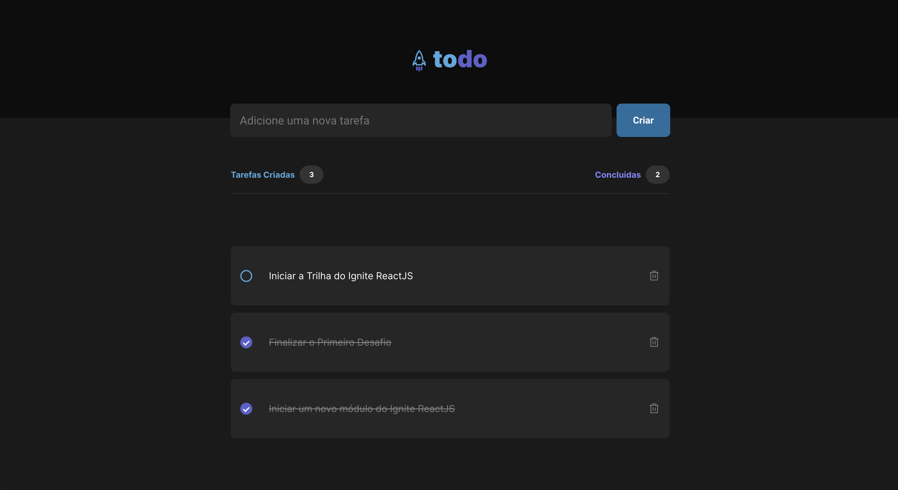

<h1 align="center">
  
</h1>

## 💻 Projeto

O ToDo é o desafio do primeiro módulo do curso Ignite ReactJS da Rocketseat

## ✨ Tecnologias

- [React](https://pt-br.reactjs.org/)
- [TypeScript](https://www.typescriptlang.org/)
- [Phosphor Icons](https://phosphoricons.com/)

## 🚀 Como executar

- Clone o repositório
- Rode `yarn` para baixar as dependências
- Rode o `yarn dev` para iniciar a aplicação.